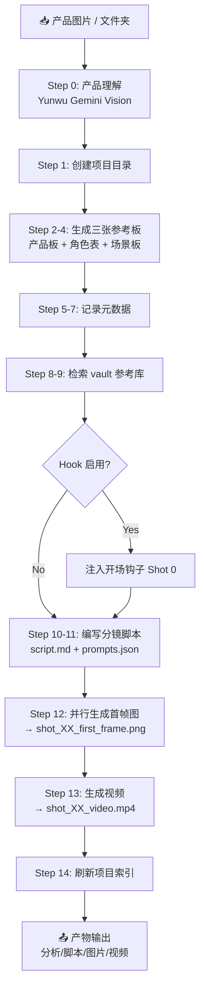
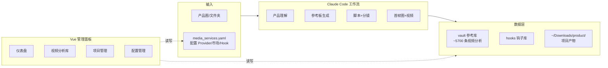
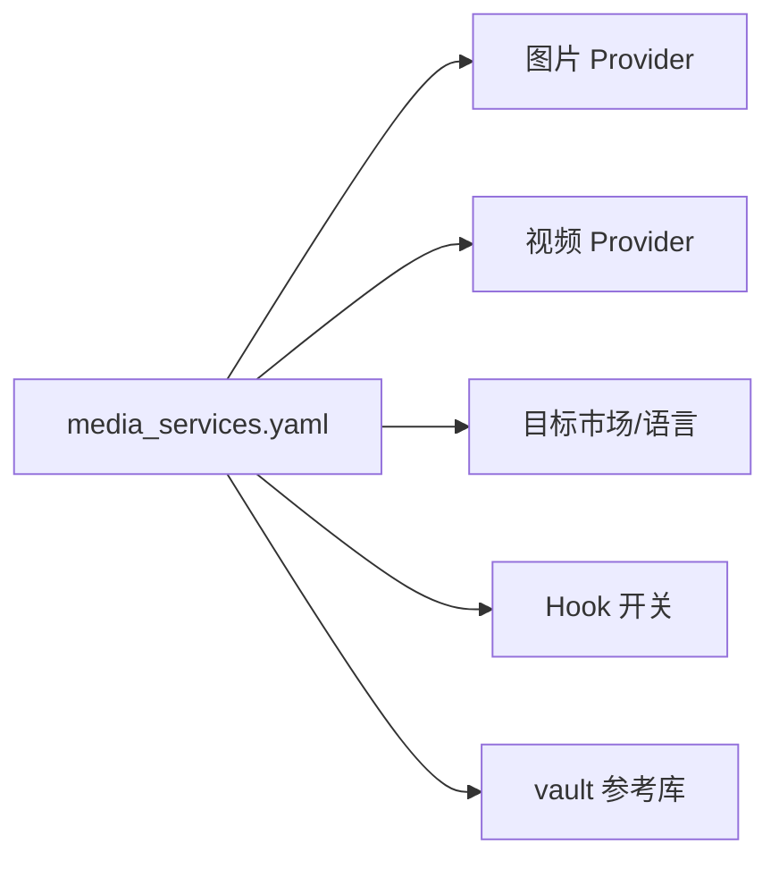
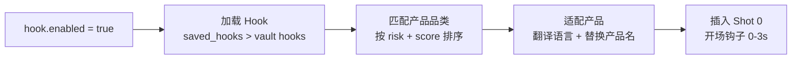

# 🛍️ shuke-product — 带货视频工作流

Claude Code 技能 + 带货视频分析参考库 + Vue 可视化管理面板，覆盖短视频带货脚本、商品图生成、视频生成和竞品分析全流程。

## 整体架构



### 输入 → 输出总览



### 配置驱动



### Hook 注入流程



## 一键安装

### 第一步：安装技能

启动 Claude Code 后，发送以下指令：

> **「帮我从 git@github.com:shukeCyp/shuke_product.git 安装带货工作流」**

Claude Code 会自动 clone 仓库、复制技能、检查配置，等待完成即可。

### 第二步：配置 API Key

安装完成后，发送以下指令让 Claude Code 帮你配置：

> **「帮我配置 shuke-product：云雾 API Key 填 xxx，图片生成和视频生成的 provider 都设置成超稳 AI，图片 Key 填 xxx，视频 Key 填 xxx」**

（把 `xxx` 分别替换成你自己的云雾 Key、超稳 AI 图片 Key、超稳 AI 视频 Key）

图片生成也可以用斑点蛙（gpt-image-2）：

> **「帮我配置 shuke-product：图片生成的 provider 设置成斑点蛙，Key 填 xxx」**

### 第三步：开始使用

直接发送：

> **「product-image-video-storyboard + 你的产品图片」**

然后等待 Claude Code 生成结果即可。

## 工作流详解

### 输入模式

| 输入 | 主图 | 附加上下文 | source/ 内容 |
|------|------|-----------|-------------|
| 单张图片 | 该图片 | 无 | 该图片 |
| 文件夹 (1图+1信息文件) | 该图 | 信息文件合并到分析 prompt | 全部文件 |
| 文件夹 (多图+信息) | 最大图片 | 信息文件合并 | 全部文件 |
| 文件夹 (仅有图片) | 最大图片 | 无 | 全部图片 |

### Step 0：产品图片理解（必须第一步）

调用 Yunwu Gemini Vision API (`gemini-3.1-pro-preview`) 进行结构化视觉分析，提取：产品类型、包装细节、文字信息、颜色、材质、品牌、使用场景、目标语言。分析结果保存为 `product_analysis.md` 和 `product_analysis.json`。

### Step 1-5：生成参考板

| 步骤 | 产物 | 说明 |
|------|------|------|
| Step 2 | `product_reference_board.png` | 产品多角度视图 + 尺寸标注 + 细节特写 |
| Step 3 | `character_reference_sheet.png` | 角色面部/表情/手部/穿搭（不能出现产品） |
| Step 4 | `scene_reference_board.png` | 多视角场景布局 + 灯光 + 空位（不能出现产品） |

Step 3 和 Step 4 在 Flow/flow2api 下可并行生成。

### Step 8-10：检索 + 脚本

从本地 vault 参考库检索同品类/同受众/同钩子风格的视频，提取结构参考。结合 Hook 配置（如启用）注入开场钩子镜头，编写完整分镜表：

| 镜头 | 规划时长 | 生成时长 | 画面 | 口播/字幕 | 首帧图提示词 | 视频提示词 | 剪辑备注 |

### Step 12-14：媒体生成

- **首帧图**：并行批量生成（最多 5 个并发），使用三张参考板 + Voice Identity Lock
- **视频**：从首帧图生成 8s 视频，每镜头一个明确的物理动作
- **项目索引**：刷新 `~/Downloads/product/projects.json`

### 核心约束

- **角色一致性**：所有镜头同一人（面部、手部、穿搭、发型不变）
- **声音一致性**：所有视频同一 Voice Identity Lock（性别/年龄/音调/语速/口音）
- **场景连续性**：同一拍摄地点、灯光方向、背景布局
- **UGC 风格**：手机拍摄感、自然光线、真实场景，拒绝商业广告风
- **语言本地化**：根据 `commerce_market` 配置输出对应语言的脚本/字幕/CTA

## Vue 可视化管理面板

`frontend/` 目录提供了一套完整的 Vue 3 + Element Plus 管理面板。

### 启动

```bash
cd frontend
npm install
npm run dev        # 同时启动 API 服务(3001) + Vite 开发服务器(5173)
```

### 页面功能

| 页面 | 路由 | 功能 |
|------|------|------|
| 仪表盘 | `/` | 统计卡片、评分分布图、品类/钩子分布图、快捷入口 |
| 视频分析库 | `/vault` | 多维度筛选（品类/钩子/视频类型/风险/平台）、排序、分页浏览 |
| 视频详情 | `/vault/:id` | 评分雷达图、标签体系、钩子/CTA 信息、改造建议、完整分析 |
| 钩子库 | `/hooks` | 钩子卡片展示，按类型/风险筛选，查看开场脚本和话术示例 |
| 配置管理 | `/config` | 查看/在线编辑 media_services.yaml，API Key 默认隐藏 |
| 项目列表 | `/projects` | 浏览 ~/Downloads/product/ 下的生成项目 |
| 项目详情 | `/projects/:id` | 媒体画廊（图片/视频）、分镜脚本、产品分析、提示词 |

### 技术栈

Vue 3 + TypeScript + Vite + Element Plus + ECharts + Pinia + Vue Router + Express

## 目录结构

```
shuke_product/
├── README.md
├── frontend/                          # Vue 可视化管理面板
│   ├── server/index.js                # Express API 后端
│   └── src/
│       ├── views/                     # 7 个页面
│       ├── components/                # 5 个可复用组件
│       ├── stores/                    # Pinia 状态管理
│       ├── api/                       # API 请求层
│       └── types/                     # TypeScript 类型
├── skills/shuke-product/              # Claude Code 技能
│   ├── config/
│   │   ├── media_services.example.yaml   # 配置模板
│   │   └── media_services.yaml           # 本地密钥配置 (.gitignore)
│   ├── bandianwa-media-generation/       # 斑点蛙图片生成
│   ├── catking-media-generation/         # CatKing 视频生成
│   ├── chaowenai-media-generation/       # 超稳AI 图片 & 视频生成
│   ├── commerce-script-retrieval/        # 带货脚本检索
│   ├── commerce-video-tagging/           # 带货视频打标
│   ├── cloudy-veo-generation/            # VEO 视频生成
│   ├── flow2api-media-generation/        # 图片 & 视频生成
│   ├── nanobanana2-image-prompting/      # Nano Banana 提示词
│   ├── product-image-video-storyboard/   # 商品图/视频分镜
│   ├── product-image-understanding/      # 产品图片理解
│   ├── veo31-video-prompting/            # Veo 3.1 提示词
│   ├── yunwu-video-commerce-analysis/    # 视频带货分析
│   └── vault/                            # 参考库 (~5700 条)
│       ├── index/videos.jsonl
│       ├── tags/
│       ├── analyses/
│       ├── hooks/
│       └── schemas/
└── product/                              # 生成产物
```

## 各服务配置

| 服务 | 用途 | URL | Key |
|------|------|-----|-----|
| **超稳AI** | 图片生成 / 视频生成 | `https://api.chaowenai.com` | 图片 Key + 视频 Key |
| **斑点蛙** | 图片生成（gpt-image-2） | `https://api.hellobabygo.com` | API Key |
| **Flow2API** | 图片生成 / 视频生成 | 按需配置 | 按需配置 |
| **Cloudy VEO** | VEO 3.1 视频生成 | `https://api.dealonhorizon.us` | API Key |
| **CatKing** | Veo 3.1 视频生成 | `https://api.catking.top` | API Key |
| **Yunwu** | 视频分析（Gemini） | `https://yunwu.ai` | API Key |

> 斑点蛙注册：https://api.hellobabygo.com/register?aff=W3gr
> CatKing 注册：https://api.catking.top/register?aff=MRgf

## 更新

直接发送以下指令给 Claude Code：

> **「帮我从 git@github.com:shukeCyp/shuke_product.git 更新带货工作流」**

## 常见问题

**Q：另一台电脑上 Claude Code 没有 Vision 模型怎么办？**
A：问 Claude Code：「帮我配置 Vision 模型」，它会检查 ~/.claude/ 下的配置并指导配置。

**Q：怎么看技能有没有加载成功？**
A：问 Claude Code：「检查 shuke-product 技能」或「列出所有技能」。

**Q：其他电脑没有 SSH 密钥访问 GitHub 怎么办？**
A：用 HTTPS 地址：`https://github.com/shukeCyp/shuke_product.git`
